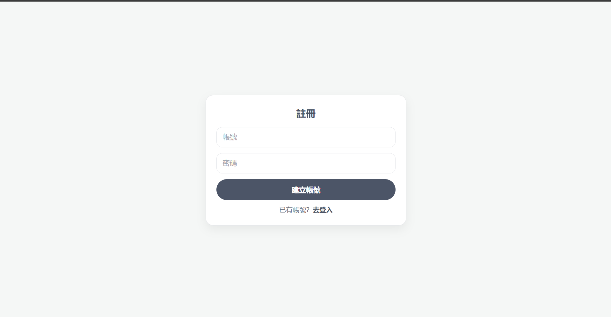
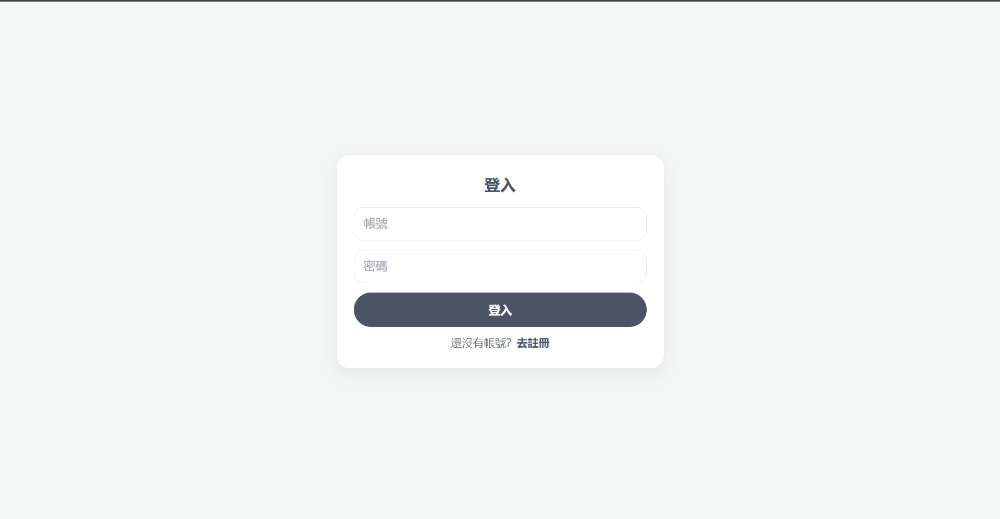
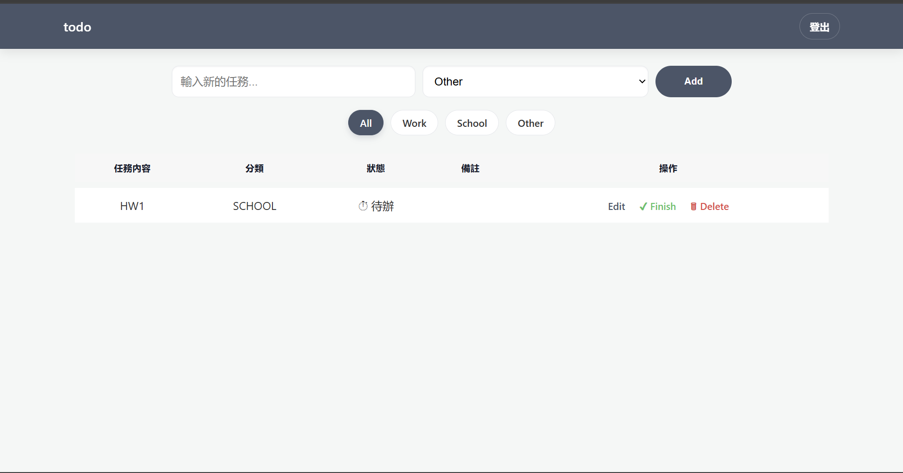

## HW1

In Homework 1, I built a simple Flask–MySQL **to-do list** application.
It demonstrates how to connect Flask to a MySQL database and use a frontend form to insert and display data.

### | Demo Video:
- [YouTube link](https://youtu.be/utjzXJw3qaw)

### | Source Code:

[Source Code](https://github.com/PhoebeLu1011/1141-database/tree/main/HW1)

### | Interface Preview:

| Register | Log in | Index |
|----------|-----------|-----------|
|  |  |  |

### | Project Structure:
```
HW1/
├── app.py # MAIN
├── templates/ # frontend interface
│ ├── index.html 
│ ├── login.html 
│ └── edit.html 
├── .env
└── requirements.txt
```
<details>
  <summary>
    <h3> | Important Code:</h3>
  </summary>
    
### 1. Flask × MySQL Configuration 

```py
load_dotenv()
app = Flask(__name__)

# MySQL connection settings(.env)
app.config.update(
MYSQL_HOST=os.getenv("MYSQL_HOST", "127.0.0.1"),
MYSQL_PORT=int(os.getenv("MYSQL_PORT", "3306")),
MYSQL_USER=os.getenv("MYSQL_USER", "root"),
MYSQL_PASSWORD=os.getenv("MYSQL_PASSWORD", ""),
MYSQL_DB=os.getenv("MYSQL_DB", "todolist"),
MYSQL_CURSORCLASS="DictCursor",
)
mysql = MySQL(app)
```
This configuration block connects Flask to a MySQL database using environment variables defined in the .env file.

### 2. Data Insertion 
This code snippet precisely demonstrates **how Flask handles POST requests, retrieves data from a form, and inserts it into the MySQL database.**
```py
# Retrieve multiple records (e.g., all to-do items)
def query_all(sql, params=None):
    cur = mysql.connection.cursor()
    cur.execute(sql, params or ())
    rows = cur.fetchall()
    cur.close()
    return rows
# Fetch a single record from the database
# e.g. Check if an account exists in register()
def query_one(sql, params=None):
    cur = mysql.connection.cursor()
    cur.execute(sql, params or ())
    row = cur.fetchone()
    cur.close()
    return row

# Execute INSERT, UPDATE and commit the transaction
# e.g. 
#   - Insert a new to-do item in add()
#   - Register a new user in register()
#   - Update the task status in complete()
def exec_sql(sql, params=None):
    cur = mysql.connection.cursor()
    cur.execute(sql, params or ())
    mysql.connection.commit()
    cur.close()

```
### 3. Handle both GET (load page) and POST (submit form) requests — Login
```py
@app.route("/login", methods=["GET", "POST"])
def login():
    # When the user submits the login form
    if request.method == "POST":
        # Retrieve the username and password values from the frontend form
        username = request.form.get("username", "").strip()
        password = request.form.get("password", "")
        # Query the database to check if the account exists
        user = query_one("SELECT id, username, password_hash FROM users WHERE username=%s", [username])
        if not user or not check_password_hash(user["password_hash"], password):
            flash("帳號或密碼錯誤")
            return redirect(url_for("login"))
        session["user_id"] = user["id"]
        session["username"] = user["username"]
        flash("登入成功")
        nxt = request.args.get("next")
        return redirect(nxt or url_for("index"))
    return render_template("login.html", mode="login")
```
### 4. Add new to-do items (POST only, login required)
```py
# Display all to-do items
@app.route("/")
def index():
    todos = query_all(
        "SELECT id, task, category, status, note FROM todos ORDER BY id DESC"
    )
    return render_template("index.html", todos=todos)

@app.route("/add", methods=["POST"])
@login_required
def add():
    task = request.form.get("task", "").strip()
    category = request.form.get("category", "").strip() or "other"
    if not task:
        flash("請輸入任務內容")
        return redirect(url_for("index"))
    
    # Insert a new record into the database
    exec_sql(
        "INSERT INTO todos (task, category, status, user_id) VALUES (%s, %s, %s, %s)",
        (task, category, "未完成", g.user["id"])
    )
    return redirect(url_for("index"))
```


### | Setup:
### 1. Installation 
Install the necessary Python packages in `requirements.txt`.
```bash
pip install -r requirements.txt
```
### 2. Environment Variables
Create a .env file in the project root directory to store your database configuration and secret key. Replace the placeholder values with your actual MySQL credentials.
```env
# Flask secret key (for sessions, CSRF protection, etc.)
SECRET_KEY= your_secure_secret_key  

# MySQL database configuration
MYSQL_HOST = your_host_ip_or_domain
MYSQL_PORT = 3306
MYSQL_USER = your_mysql_username
MYSQL_PASSWORD = ""          
MYSQL_DB = "todolist"         
MYSQL_CURSORCLASS = DictCursor
MYSQL_CHARSET = utf8mb4
```
### 3. How to Run
After setting up the database and installing dependencies, run the application:
```python
py app.py
```
</details>


## HW2
This homework extends the theme “To-Do List” from Homework 1.
The system has been upgraded from using a single database table to a three-table relational structure (users, tasks, and categories). In addition, it through database normalization and the use of JOIN operations, the application can effectively manage the relationships among users, tasks, and categories, while implementing **CRUD** functionality — Create, Read, Update, and Delete.

### | Demo Video:

- [YouTube link]()

### | Code:
- [Code]()

### | CRUD
1. C - Create 

- Users can add new tasks to their personal to-do list through the input form.

2. R - Read

- The system presents the to-do list of the currently logged-in user, including detailed information for each task such as its name, category, status, and notes.

3. U - Update

- The edit function allows users to update task details or notes.
- When the user clicks the “Finish” button at the main page, the task status changes automatically from “未完成” (not finished) to “完成” (finished).

4. D - Delete
- Users can remove any task they no longer need by clicking the **“Delete”** button.


